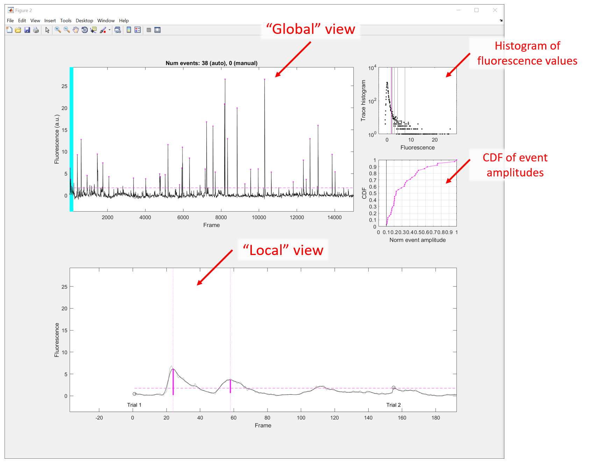
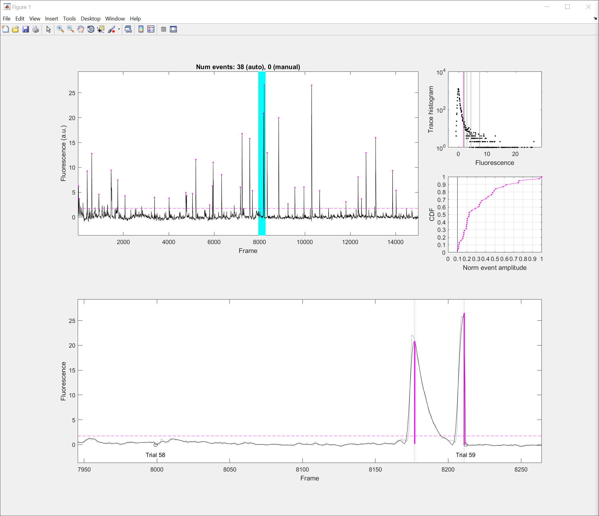

## Detecting events from fluorescence traces

### Basic usage

Begin by instantiating a `DaySummary` object that contains the traces for event detection (see the [`DaySummary` Quickstart](docs/ds_quickstart.md) for background info):
```
>> sources = data_sources
sources = 
  struct with fields:
         maze: '_data/c14m4d15_ti2.txt'
     behavior: '_data/c14m4d15_ti2.mp4'
     tracking: '_data/c14m4d15_ti2.xy'
    miniscope: '_data/c14m4d15_gfix_rm_cr_mc_cr_norm40_dff_ti2.hdf5'

>> ds = DaySummary(sources.maze, 'cm01-fix');
30-Oct-2017 11:59:38: Loaded 364 filters and traces (export_rec) from cm01-fix\rec_161217-182928.mat
30-Oct-2017 11:59:38: Loaded trial metadata from _data/c14m4d15_ti2.txt
  Computing trace correlations between all sources... Done (0.3 sec)
  Computing auxiliary spatial parameters... Done (5.3 sec)
  Computing distances between all sources... Done (0.3 sec)
30-Oct-2017 11:59:47: Loaded classification from cm01-fix\class_161217-183059.txt
```

Remarks:
- Do not apply probe trial elimination (e.g. the `'noprobe'` flag) on `DaySummary` instantiation. Global trace properties (e.g. the standard deviation of the baseline) will be affected by omission of trials. Let's pre-emptively avoid future confusion by always applying event detection on the full trace from each session.
- Event detection will be performed for _all_ sources in the `DaySummary`, whether or not the source has been classified to be a cell. For this reason, it's advised to perform event detection on `DaySummary` instances containing only classified cells (i.e. the output of `export_rec` with the `fix_baseline` flag enabled).

The following command performs event detection on Cell 267 of this `DaySummary` instance:
```
>> events = detect_events(ds, 267);
```
which opens the following window:


The "Global" view shows the trace of Cell 267 for all frames. Additionally:
- Dashed, horizontal magenta line indicates the fluorescence threshold for event detection. By default, it is five standard deviations off of the baseline.
- Magenta dots indicate detected events.
- The cyan highlight indicates the portion of the trace that is displayed in the "Local" view.

The "Local" view shows an expanded version of the trace, so that waveforms and exact event timings can be inspected:
- Initially, the "Local" view shows the trace over Trial 1. The beginning of each trial is indicated by an open circle and a corresponding text that reads "Trial X".
- The horizontal magenta line indicates the fluorescence threshold (same as in the Global view). Vertical magenta lines indicate detected events, with the length of the bolded portion indicating the event amplitude.
- With the user's mouse cursor over the figure, scrolling up and down with the mouse wheel will decrement or increment the trial index, respectively.

In addition to the mouse wheel, you can directly jump to a particular trial via the Command Window. For example:
```
>> events = detect_events(ds, 267);
Detector >> 58
Detector >>
```
will highlight Trial 58 in the Local view as follows:


To exit from the interaction loop of `detect_events`, type "q" in the Command Window:
```
>> events = detect_events(ds, 267);
Detector >> 58
Detector >> q
>> 
```

The result of `detect_events` is a struct with the following content:
```
>> events
events = 
  struct with fields:
      info: [1×1 struct]
      auto: [38×3 double]
    manual: []
```
where:
- `events.info` is itself a struct containing extra information associated with the event detection run, such as the standard deviation of the trace baseline, and algorithm thresholds.
- `events.auto` is a `[num_events x 3]` matrix that specifies the "automatically" (i.e. algorithmically) computed events.
- `events.manual` is a `[num_events x 3]` matrix containing events manually selected by the user during `detect_events`. (This feature is currently disabled.)

The columns of `events.auto` (and `events.manual`) are as follows:
1. The frame index of the trough immediately preceding the fluorescence peak,
2. The frame index of the fluorescence peak,
3. The event amplitude defined as the difference in fluorescence between the peak and the trough.

Note that sometimes the trough preceding the peak cannot be found. This typically occurs if the event occurs at the beginning of a trial, and the minimum preceding the peak cannot be found within that trial. In this case, `detect_events` sets the trough frame to be `-Inf`, and the event amplitude is defined to be the fluorescence difference between the peak and the trace baseline.

### Detect events without user interaction

To bypass the interaction loop (and use default parameters for event detection), use the `'noprompt'` flag:
```
>> events = detect_events(ds, 267, 'noprompt');
```
which returns immediately.

To detect events for all cells in the `DaySummary` instance, use the `detect_all_events` convenience function:
```
>> all_events = detect_all_events(ds);
30-Oct-2017 13:12:41: At cell 1 of 364...
30-Oct-2017 13:12:53: At cell 50 of 364...
...
30-Oct-2017 13:14:11: At cell 350 of 364...
```
Here `all_events{k}` is the result of `detect_events` for Cell k.


### Adjusting event detection parameters

To be added.

### Explanation of event detection algorithm

To be added.
