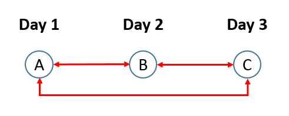
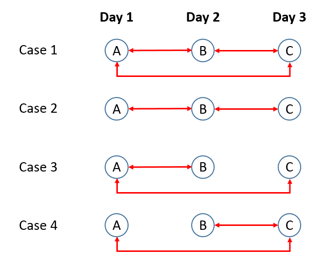
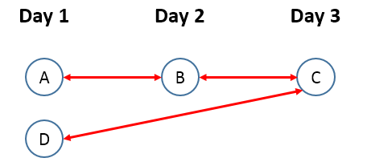

## Quickstart to `MultiDay` usage

A single `DaySummary` instance encapsulates the information associated with a single session of the strategy shifting experiment. A `MultiDay` object is built on top of `DaySummary` and is intended to handle the low-level mechanics of multi-session cell alignment.

#### Instantiating a `MultiDay` instance

In this tutorial, we will create a `MultiDay` object from three `DaySummary` instances. We assume the following `DaySummary` variables exist in the Matlab workspace: `m1d12`, `m1d13`, `m1d14` (i.e. Days 12, 13, 14 of Cohort 11 / Mouse 1).

Additionally, in order to instantiate a `MultiDay` object based on the above `DaySummary` instances, we also need the "match matrices" between the days. We assume that the following match matrices exist in the workspace: `m_12to13`, `m_13to12`, `m_12to14`, `m_14to12`, `m_13to14`, `m_14to13`. (See [here](alignment.md) for more information on match matrices.)

Instntiation of a `MultiDay` object requires a list of `DaySummary`s (`ds_list`) and a list of match matrices (`match_list`). They are formatted as follows:
```
>> ds_list = {12, m1d12; 13, m1d13; 14, m1d14}

ds_list = 
    [12]    [1x1 DaySummary]
    [13]    [1x1 DaySummary]
    [14]    [1x1 DaySummary]

>> match_list = {12, 13, m_12to13, m_13to12; 12, 14, m_12to14, m_14to12; 13, 14, m_13to14, m_14to13}

match_list = 
    [12]    [13]    {1223x1 cell}    {1244x1 cell}
    [12]    [14]    {1223x1 cell}    {1138x1 cell}
    [13]    [14]    {1244x1 cell}    {1138x1 cell}
```

With `ds_list` and `match_list`, the `MultiDay` object can be created as:
```
>> md = MultiDay(ds_list, match_list);
11-Aug-2016 12:54:27: Day 12 has 468 classified cells (out of 1223)
11-Aug-2016 12:54:27: Day 13 has 507 classified cells (out of 1244)
11-Aug-2016 12:54:27: Day 14 has 489 classified cells (out of 1138)
  Removed 4 inconsistent matches!
11-Aug-2016 12:54:27: Found 341 matching classified cells across all days

>> md

md = 
  MultiDay with properties:
         valid_days: [12 13 14]
           num_days: 3
          num_cells: 341
    matched_indices: [341x3 double]
           sort_day: 12
```

#### Definition of cross-day match

The following three-day example illustrates the behavior of the cross-day alignment in `MultiDay`. Suppose we have a single cell that shows up on three days as: Cell A from Day 1, Cell B from Day 2, and Cell C from Day 3. An edge (shown in red, below) between two cells indicates that there is a bidirectional match.

The simplest case is when there is a match between all day pairs, as follows:



In this case, it clearly makes sense to call A / B / C to be an aligned cell.

However, the `MultiDay` matching algorithm would also consider the following relationships to indicate that A / B / C are aligned: 



Thus, it is possible to provide fewer than the full set of matches (in `match_list`) when instantiating `MultiDay`.

#### Match conflicts / "Inconsistent" matches

When creating a `MultiDay` instance from three or more `DaySummary`s, it is possible to have a "match conflict": i.e. multiple cells from the same day match to the same set of cross-day cells.

Consider the following example:



This scenario can arise when cells A and D are located very close to one another on Day 1. (See [here](https://github.com/schnitzer-lab/analysis/pull/142) for a real example.) For each pair of days, cell alignment matches are unique (i.e. if Day 1 / Cell A matches to Day 2 / Cell B, then Day 1 / Cell D _cannot_ match to Day 2 / Cell B). However, when more three or more `DaySummary`s are involved, it is possible that more than one cell from a given day match to the same set of cross-day cells.

The `MultiDay` constructor, as it is computing cross-day cellular alignments, is able to detect such match conflicts. Cells involved in match conflicts are then removed from further analysis.

#### Basic usage of the `MultiDay` object

The function `browse_multiday` allows for quick visualization of session-aligned `MultiDay` data, e.g.:
```
>> browse_multiday(md);
MD browser (Sort day 12, ID 1 of 341) >> 4
MD browser (Sort day 12, ID 4 of 341) >> 
```
yielding:
